# Entrega Final

Mi nombre es Francisco Sodo y este proyecto es el resultado de 6 meses de cursada de la carrera *Programación Backend*, en **Coderhouse**.

- **Profesor:** Alejandro Huertas.
- **Tutores:** Lucas Pereyra y Alan Sinicco.
- **Comisión:** 60220.
- **Año:** 2024.

## Proyecto BackEnd de un e-commerce.

### Intro:
La realización y entrega de este proyecto se ha trabajado de forma individual, con el apoyo de las prácticas hechas en clase y la ayuda de tutores. Cabe destacar que en mi caso, no contaba con ningún tipo de conocimiento previo relacionado a la programación Backend.

### Consigna y especificaciones:
Bajo el entorno de trabajo **MERN** *(NodeJs, Express, ReactJs, MongoDb)*, se desarrollaron todas las funcionalidades necesarias para crear un e-commerce funcional, donde se gestionan de manera profesional y robusta no solo productos y carritos, sino también usuarios y mensajería. 

Para la prueba de APIs se utilizó la herramienta **Postman**. Además, este proyecto cuenta con vistas frontend realizadas dentro del mismo backend con *Handlebars.*

**Otras expecificaciones**: En este proyecto también se ha trabajado con: 
- Patrón Repository
- Patrón DAO
- DTO
- web sockets
- bcrypt
- passport
- nodemailer
- cookies
- JWT
- commander
- multer
- swagger
- winston (loggers)
- chai, mocha, supertest
- *entre otros...*

### Inicio del server
Para iniciar el servidor se pueden utilizar los siguientes comandos:
- *npm run dev* | para iniciar en ambiente de desarrollo.
- *npm run prod* | para iniciar en ambiente de producción.

## Rutas APIs
A continuación se detallarán algunas de las rutas de las APIs mas relevantes.

### Productos
GET `api/products/` |  Arroja resultado de todos los productos.

GET `api/products/:pid/` |  Busca producto por id.

POST `api/products/` |  Crea un producto.

POST `mockingproducts/db/` |  Crea 10 productos "mockeados" mediante la libreria *faker*.

UPDATE `api/products/:pid/` |  Actualiza / edita un producto.

DELETE `api/products/:pid/` |  Elimina un producto.

### Carritos
GET `api/carts/:cid/` |  Busca un carrito por id.

POST `api/products/` |  Crea un carrito (El carrito se crea y se asigna automáticamente a un usuario al darse de alta, siempre y cuando su rol no sea Administrador.)

PUT `api/carts/:cid/product/:pid/` | Coloca un producto en un carrito.

DELETE `api/carts/:cid/product/:pid/` | Elimina un producto dentro de un carrito.

DELETE `api/carts/:cid/` | Vacía todos los productos dentro de un carrito.

GET `api/carts/:cid/product/:pid/purchase/` | Finaliza la compra de un producto y envía un ticket con el resumen de la operación al email del comprador.

### Usuarios
Para el manejo de usuarios, se ha trabajado con estrategias de autorización y autenticación, estableciendo diferentes permisos para los roles "Administrador" (admin), "Premium" (premium), "Usuario" (user). 
Además, para estas APIs se han aplicado **custom routers**.

POST `api/extend/users/register/` |  Registra un usuario y le envía un email de confirmación y bienvenida. Se solicitan datos como: Nombre, Apellido, email, edad y contraseña.

POST `api/extend/users/login/` |  Loguea un usuario mediante su email y una contraseña.

GET `api/extend/users/current/` |  Muestra el usuario actualmente logueado.

GET `api/extend/users/current/:uid/` |  Busca un usuario mediante su id.

POST `api/extend/users/logout/` |  Desloguea un usuario.

PUT `api/extend/users/premium/:uid/` |  Cambia el rol user <-> premium del usuario que lo solicite. Requiere el envío de documentación.

POST `api/extend/users/:uid/documents/` |  Permite al usuario cargar documentación (necesaria para el cambio de rol por ejemplo).

DELETE `api/extend/users/inactive/` |  Se ejecuta para eliminar usuarios que hayan estado inactivos por un año. Se le informa mediante un correo.

## Rutas Frontend (handlebars)
A continuación se detallarán algunas de las vistas mas relevantes en el proceso de compra, y sus rutas.
**Cabe estacar que el scope del proyecto es el backend, por lo tanto el desarrollo y estilo de las vistas se ejecutó de una manera rudimentaria.**

### Registro
`user/register`

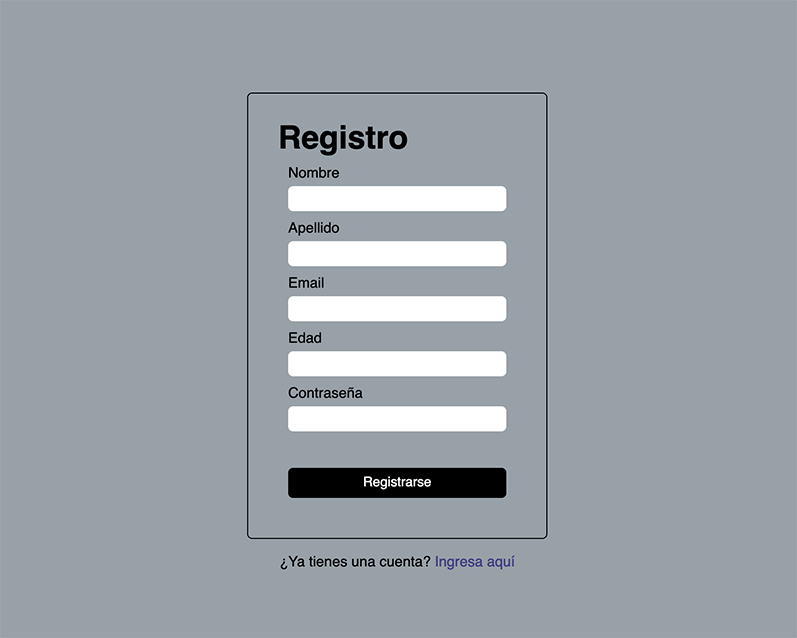

### Login
`user/login`

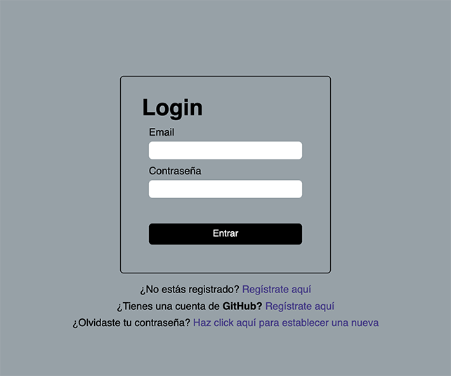

**Login con Github**

### Perfil
`user/current/user`

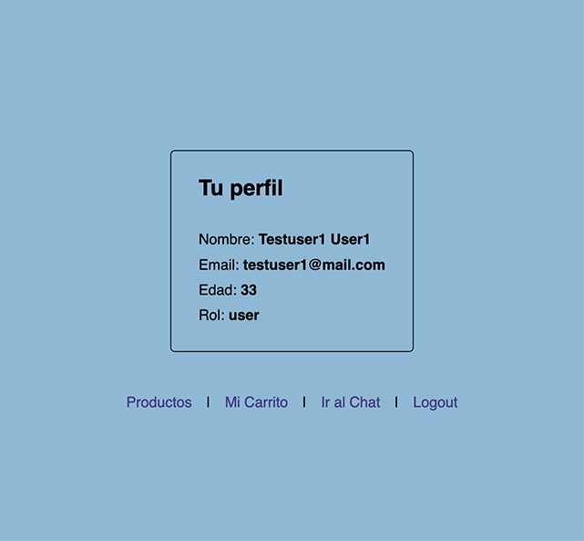

### Productos
`/products`

Para la paginación se ha aplicado *mongoose paginate.*

En la imagen se puede apreciar que todas las fotos son similares, ya que se esta usando la librería *faker*, que genera toda la información del producto de forma aleatoria.

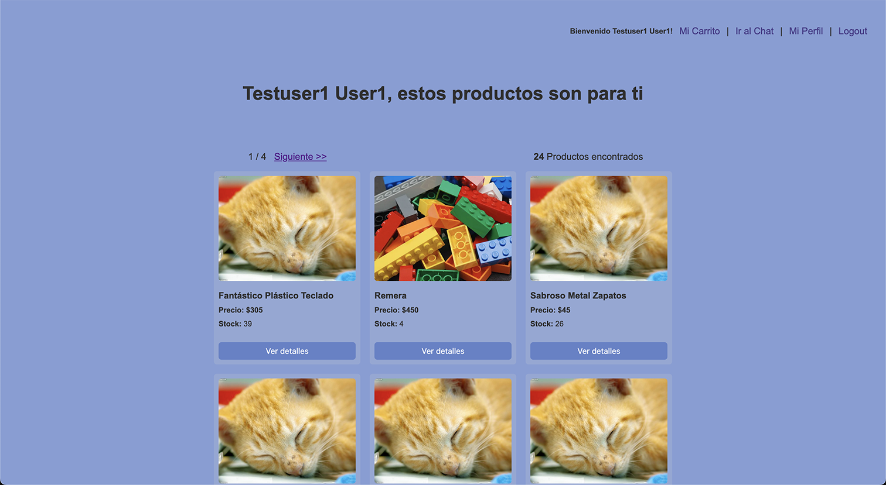

### Detalle del producto
`products/product/:pid`

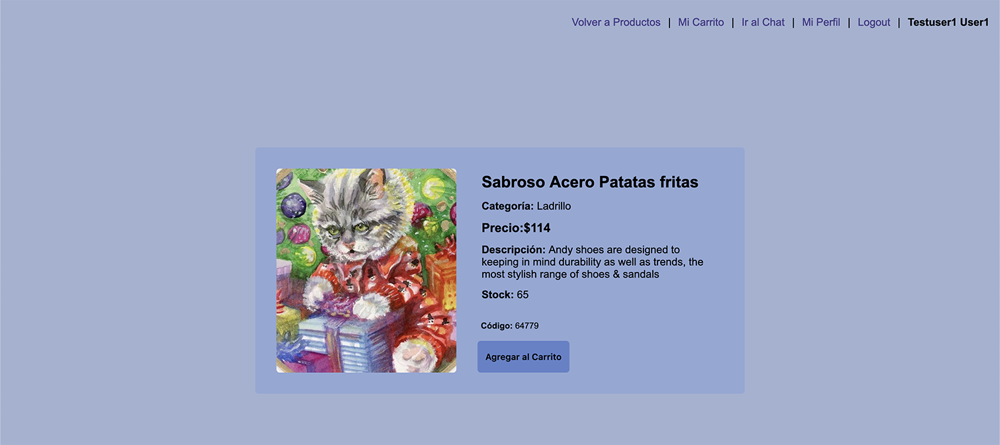

### Carrito
`carts/:cid`

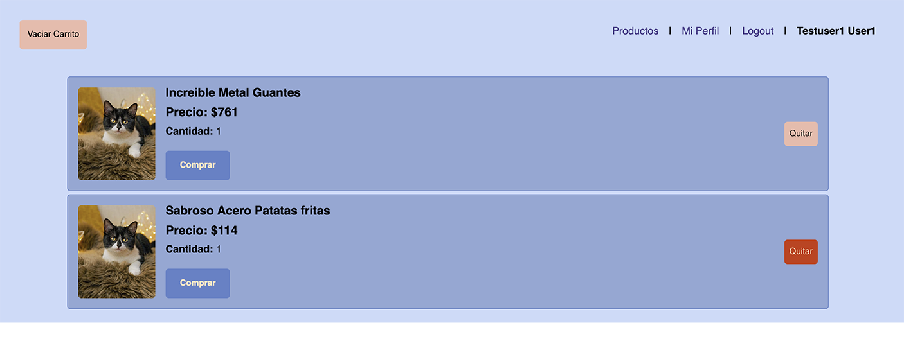

**Producto comprado**

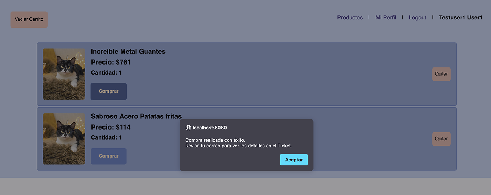

**Correo recibido luego de compra exitosa**

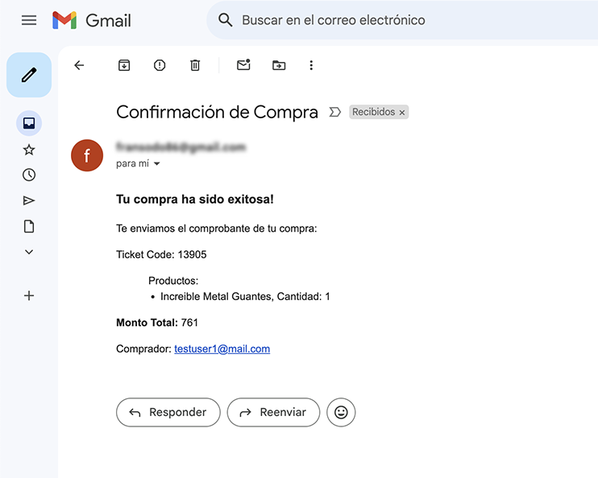

### Email recibido al solicitar reseteo de contraseña

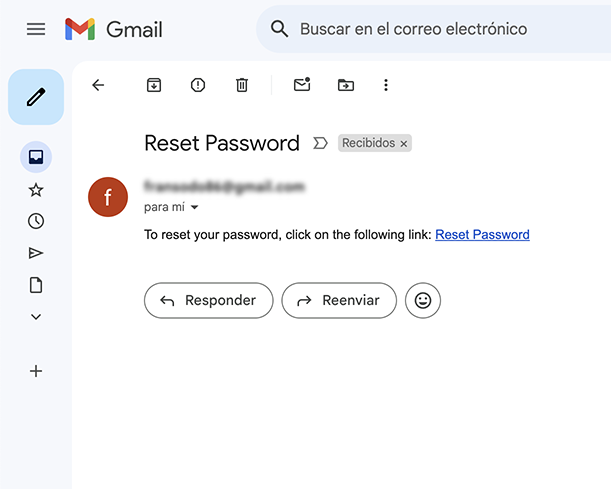

**Vista para ingresar nueva contraseña luego de ingresar al link enviado**

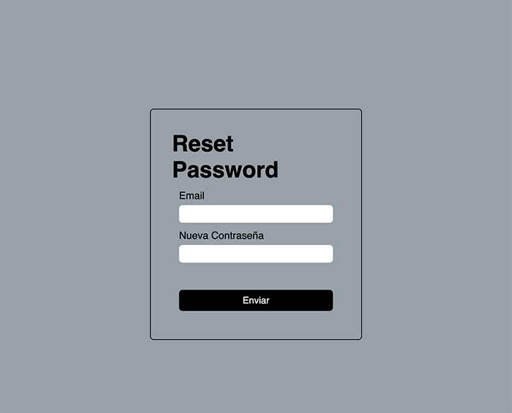

### Logout

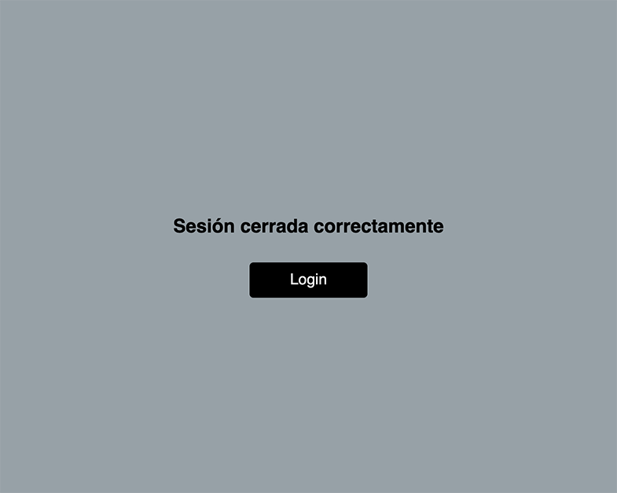

